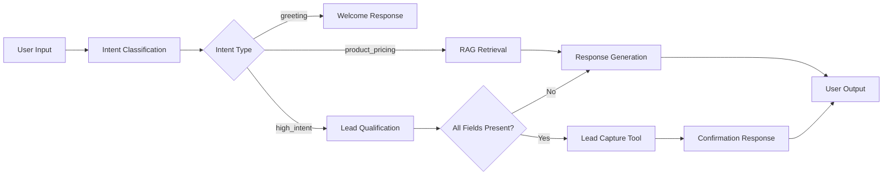

<div align="center">

# 🎯 Inflx Social-to-Lead Agentic Workflow

### *Intelligent AI-Powered Lead Qualification & Conversion System*

[](https://www.python.org/downloads/)
[](https://fastapi.tiangolo.com/)
[](https://github.com/langchain-ai/langgraph)
[](https://reactjs.org/)
[](https://www.typescriptlang.org/)
[](LICENSE)

**A production-ready conversational AI system that transforms social media interactions into qualified leads through intelligent dialogue management and contextual understanding.**

[Features](#-key-features) • [Quick Start](#-quick-start) • [Architecture](#-architecture-deep-dive) • [WhatsApp Integration](#-whatsapp-deployment-strategy) • [Documentation](#-documentation)

</div>

---

## 📋 Table of Contents

- [Overview](#-overview)
- [Key Features](#-key-features)
- [Tech Stack](#-tech-stack)
- [Quick Start](#-quick-start)
- [Architecture Deep Dive](#-architecture-deep-dive)
- [WhatsApp Deployment Strategy](#-whatsapp-deployment-strategy)
- [Project Structure](#-project-structure)
- [API Documentation](#-api-documentation)
- [Contributing](#-contributing)

---

## 🌟 Overview

**Inflx Social-to-Lead** is an enterprise-grade agentic workflow system that leverages advanced AI orchestration to convert casual social media conversations into qualified business leads. Built with LangGraph for stateful conversation management and powered by Groq's ultra-fast LLM inference, this system maintains context across multi-turn dialogues while intelligently extracting and validating lead information.

### What Makes This Special?

✨ **Stateful Conversations** - Maintains context across 5-6 conversation turns  
🧠 **Intent-Driven Routing** - Dynamic conversation flow based on user intent  
🎯 **Smart Lead Capture** - Automatically extracts and validates lead information  
⚡ **Lightning Fast** - Powered by Groq (10-100x faster than traditional GPU inference)  
🔄 **RAG-Enhanced** - Grounded responses using FAISS vector search  
🏗️ **Production Ready** - Modular, scalable, and deployment-ready architecture  

---

## 🚀 Key Features

### 🤖 Intelligent Agent Capabilities

| Feature | Description |
|---------|-------------|
| **Multi-Intent Classification** | Detects greeting, product inquiry, pricing questions, and high-intent signals |
| **Contextual Memory** | Remembers user preferences, previous questions, and conversation history |
| **Dynamic Plan Selection** | Intelligently recommends Basic or Pro plans based on user needs |
| **Automatic Lead Qualification** | Captures name, email, platform, and plan preference seamlessly |
| **RAG-Powered Knowledge** | Retrieves accurate product information from vector-indexed knowledge base |
| **Conversation State Tracking** | Manages flow through DISCOVERY → EXPLORING → PRICING → QUALIFIED stages |

### 💼 Business Value

- **Conversion Optimization**: Systematically guides users from curiosity to commitment
- **24/7 Availability**: Never miss a lead with always-on AI assistance
- **Scalable**: Handle unlimited concurrent conversations
- **CRM Integration Ready**: Built-in hooks for HubSpot, Salesforce, and custom CRMs
- **Multi-Channel**: Designed for web, WhatsApp, Telegram, and more

---

## 🛠️ Tech Stack

### Backend
```
🔹 FastAPI          - High-performance async API framework
🔹 LangGraph        - Stateful agent orchestration
🔹 LangChain        - LLM integration and tooling
🔹 Groq             - Ultra-fast LLM inference (Llama 3.3 70B)
🔹 FAISS            - Vector similarity search
🔹 Pydantic         - Data validation and settings management
```

### Frontend
```
🔹 React 18         - Modern UI framework
🔹 TypeScript       - Type-safe development
🔹 Vite             - Lightning-fast build tool
🔹 Tailwind CSS     - Utility-first styling
🔹 shadcn/ui        - Premium component library
```

### Infrastructure
```
🔹 Python 3.10+     - Backend runtime
🔹 Node.js 18+      - Frontend runtime
🔹 Redis (optional) - Distributed session storage
🔹 PostgreSQL       - Lead persistence (production)
```

---

## ⚡ Quick Start

### Prerequisites

Before you begin, ensure you have:

- **Python 3.10+** installed ([Download](https://www.python.org/downloads/))
- **Node.js 18+** and npm ([Download](https://nodejs.org/))
- **Groq API Key** ([Get Free Key](https://console.groq.com/keys))

### 🔧 Installation

#### 1️⃣ Clone the Repository

```bash
git clone https://github.com/yourusername/inflx-social-to-lead.git
cd inflx-social-to-lead
```

#### 2️⃣ Backend Setup

```bash
# Navigate to backend directory
cd autostream-backend

# Create and activate virtual environment
python -m venv venv

# Windows
.\venv\Scripts\Activate

# macOS/Linux
source venv/bin/activate

# Install dependencies
pip install -r requirements.txt

# Configure environment variables
# Create .env file and add:
echo "GROQ_API_KEY=gsk_your_actual_key_here" > .env

# Verify setup
python check_setup.py

# Start the backend server
.\run_server.ps1
# OR
uvicorn app.main:app --reload
```

**Backend will run on:** `http://localhost:8000`  
**API Docs:** `http://localhost:8000/docs`

#### 3️⃣ Frontend Setup

```bash
# Open new terminal and navigate to frontend
cd frontend

# Install dependencies
npm install

# Configure environment
# Create .env file and add:
echo "VITE_API_URL=http://localhost:8000" > .env

# Start development server
npm run dev
```

**Frontend will run on:** `http://localhost:5173`

### 🧪 Testing

```bash
# Test backend with automated conversation
cd autostream-backend
python test_agent.py

# Test API endpoint with curl
curl -X POST http://localhost:8000/api/chat \
  -H "Content-Type: application/json" \
  -d '{"session_id":"test-123", "message":"Hi there!"}'
```

---

## 🏗️ Architecture Deep Dive

### Why LangGraph Over AutoGen?

We chose **LangGraph** as our agent orchestration framework for several critical reasons:

#### 🎯 **Precise Control Flow**
Conversational AI for lead generation requires **deterministic, predictable behavior**. Unlike AutoGen, which excels at multi-agent simulations with emergent behavior, LangGraph provides:

- **Explicit State Transitions**: Every conversation move is intentional
- **Conditional Routing**: Dynamic paths based on intent and context
- **Debugging Transparency**: Each node is isolated and testable
- **Production Reliability**: No unpredictable agent-to-agent negotiations

#### 🔄 **Cyclic Conversation Patterns**
Real conversations aren't linear. Users jump between topics:
```
User: "Hi!" → Greeting
User: "What's your pricing?" → Product Info
User: "Actually, tell me about features first" → Back to Discovery
User: "Ok, I want Pro plan" → High Intent
```

LangGraph models this as a **directed graph** with nodes and edges, allowing natural conversation flow while maintaining state consistency.

#### 📊 **Graph Architecture**



### State Management Architecture

#### 🧠 **AgentState Schema**

Our state is the **single source of truth** for each conversation:

```python
class AgentState(TypedDict):
    # Conversation Context
    messages: List[BaseMessage]          # Full chat history
    intent: str                          # Current intent classification
    conversation_state: str              # DISCOVERY | EXPLORING | PRICING | QUALIFIED
    
    # Lead Information
    name: Optional[str]                  # Extracted user name
    email: Optional[str]                 # Validated email address
    platform: Optional[str]              # YouTube, Twitch, etc.
    selected_plan: Optional[str]         # basic | pro
    
    # Metadata
    session_id: str                      # Unique session identifier
    turn_count: int                      # Conversation length
    lead_captured: bool                  # Qualification status
    retrieved_context: Optional[str]     # RAG context
```

#### 💾 **State Persistence Strategy**

**Development (Current):**
```
In-Memory SessionStore (LRU Cache)
├── Max 100 concurrent sessions
├── 1-hour timeout per session
└── Last 5-6 turns retained
```

**Production (Recommended):**
```
Redis Cluster
├── Distributed session storage
├── Horizontal scaling support
├── Session replication
└── Persistent conversation history
```

#### 🔄 **State Transition Flow**

```
Initial State:
{
  messages: [],
  intent: null,
  conversation_state: "DISCOVERY",
  name: null,
  email: null,
  lead_captured: false
}

After "Hi, I'm Sarah":
{
  messages: [HumanMessage("Hi, I'm Sarah"), AIMessage("Welcome...")],
  intent: "greeting",
  conversation_state: "EXPLORING",
  name: "Sarah",  ← Extracted
  ...
}

After "My email is sarah@example.com, I want Pro":
{
  ...
  intent: "high_intent",
  conversation_state: "QUALIFIED",
  email: "sarah@example.com",  ← Extracted
  selected_plan: "pro",         ← Extracted
  lead_captured: true           ← Triggered
}
```

### 🔍 **Why This Architecture Wins**

| Aspect | Our Approach | Benefit |
|--------|--------------|---------|
| **Modularity** | Each node has single responsibility | Easy testing, swappable LLMs |
| **Statefulness** | LangGraph + SessionStore | Context-aware multi-turn conversations |
| **Scalability** | Stateless API + Redis | Horizontal scaling, load balancing |
| **Maintainability** | Prompts separated from logic | Non-technical team can edit prompts |
| **Observability** | Structured logging at each node | Easy debugging and monitoring |

---

## 📱 WhatsApp Deployment Strategy

### Integration Architecture

To deploy this agent on WhatsApp, we transition from a **pull model** (frontend polling) to a **push model** (webhooks).

#### 🔗 **High-Level Flow**

```
┌─────────────┐         ┌──────────────┐         ┌─────────────┐
│   WhatsApp  │  HTTP   │   FastAPI    │  Graph  │  LangGraph  │
│    User     │ ──────> │   Webhook    │ ──────> │   Agent     │
│             │ <────── │   Endpoint   │ <────── │   Workflow  │
└─────────────┘  Reply  └──────────────┘ Response└─────────────┘
```

### Implementation Guide

#### 1️⃣ **Provider Selection**

Choose a WhatsApp Business API provider:

| Provider | Pros | Cons |
|----------|------|------|
| **Meta Cloud API** | Official, free tier, direct integration | Complex setup, verification required |
| **Twilio** | Easy setup, great docs, reliable | Paid service, per-message pricing |
| **360Dialog** | EU-based, GDPR compliant | Requires business verification |

#### 2️⃣ **Webhook Endpoint Implementation**

Add to `autostream-backend/app/main.py`:

```python
from fastapi import Request, HTTPException
import hmac
import hashlib

@app.post("/api/webhooks/whatsapp")
async def whatsapp_webhook(request: Request):
    """
    Receives incoming WhatsApp messages via webhook
    """
    # 1. Verify webhook signature (security)
    signature = request.headers.get("X-Hub-Signature-256")
    body = await request.body()
    
    expected_signature = hmac.new(
        WHATSAPP_WEBHOOK_SECRET.encode(),
        body,
        hashlib.sha256
    ).hexdigest()
    
    if not hmac.compare_digest(signature, f"sha256={expected_signature}"):
        raise HTTPException(status_code=403, detail="Invalid signature")
    
    # 2. Parse WhatsApp payload
    payload = await request.json()
    message = payload["entry"][0]["changes"][0]["value"]["messages"][0]
    
    phone_number = message["from"]  # Sender's phone
    text = message["text"]["body"]  # Message content
    
    # 3. Use phone number as session ID
    session_id = f"wa_{phone_number}"
    
    # 4. Process through existing agent graph
    response = await chat(ChatRequest(
        session_id=session_id,
        message=text
    ))
    
    # 5. Send reply via WhatsApp API
    await send_whatsapp_message(
        to=phone_number,
        message=response.reply
    )
    
    return {"status": "success"}

async def send_whatsapp_message(to: str, message: str):
    """
    Sends message back to WhatsApp user
    """
    # Example using Twilio
    from twilio.rest import Client
    
    client = Client(TWILIO_ACCOUNT_SID, TWILIO_AUTH_TOKEN)
    client.messages.create(
        from_=f"whatsapp:{TWILIO_WHATSAPP_NUMBER}",
        to=f"whatsapp:{to}",
        body=message
    )
```

#### 3️⃣ **Session Mapping Strategy**

```python
# Phone number becomes session identifier
session_id = f"wa_{phone_number}"  # e.g., "wa_+1234567890"

# Retrieve or create session
state = session_store.get_or_create(session_id)

# Process message through graph
result = agent_graph.invoke({
    "messages": [HumanMessage(content=text)],
    **state
})

# Update session
session_store.update(session_id, result)
```

#### 4️⃣ **Async Processing Pattern**

WhatsApp expects webhook responses within 5 seconds. Since our agent might take longer:

```python
from fastapi import BackgroundTasks

@app.post("/api/webhooks/whatsapp")
async def whatsapp_webhook(request: Request, background_tasks: BackgroundTasks):
    # Parse payload
    phone_number, text = parse_whatsapp_payload(await request.json())
    
    # Immediately acknowledge receipt (< 5 seconds)
    background_tasks.add_task(process_and_reply, phone_number, text)
    
    return {"status": "received"}  # WhatsApp gets instant 200 OK

async def process_and_reply(phone_number: str, text: str):
    # This runs in background
    session_id = f"wa_{phone_number}"
    response = await chat(ChatRequest(session_id=session_id, message=text))
    await send_whatsapp_message(phone_number, response.reply)
```

#### 5️⃣ **Media Handling**

WhatsApp supports images, videos, and documents:

```python
# Detect media messages
if "image" in message:
    image_url = message["image"]["url"]
    # Download and process image
    # Could use vision model to analyze
    
if "document" in message:
    doc_url = message["document"]["url"]
    # Process PDF, extract text, add to context
```

### 🚀 **Deployment Checklist**

- [ ] Register WhatsApp Business Account
- [ ] Set up webhook endpoint with HTTPS (required)
- [ ] Configure webhook URL in Meta/Twilio dashboard
- [ ] Verify webhook signature validation
- [ ] Test with WhatsApp Sandbox
- [ ] Implement rate limiting (WhatsApp has limits)
- [ ] Add error handling and retry logic
- [ ] Monitor webhook delivery failures
- [ ] Set up logging for compliance

### 🔒 **Security Considerations**

1. **Signature Verification**: Always validate webhook signatures
2. **HTTPS Only**: WhatsApp requires SSL/TLS
3. **Rate Limiting**: Prevent abuse with request throttling
4. **Data Privacy**: Store phone numbers securely, comply with GDPR
5. **Message Encryption**: WhatsApp uses E2E encryption, but log carefully

---

## 📁 Project Structure

```
inflx-social-to-lead/
│
├── 📂 autostream-backend/          # FastAPI Backend
│   ├── 📂 app/
│   │   ├── main.py                 # FastAPI application entry
│   │   ├── api.py                  # API endpoints
│   │   ├── config.py               # Configuration management
│   │   │
│   │   ├── 📂 agent/               # LangGraph Agent Core
│   │   │   ├── graph.py            # Agent workflow orchestration
│   │   │   ├── state.py            # AgentState schema
│   │   │   ├── intent.py           # Intent classification
│   │   │   ├── rag.py              # RAG pipeline (FAISS)
│   │   │   ├── prompts.py          # LLM prompt templates
│   │   │   └── tools.py            # Lead capture tools
│   │   │
│   │   ├── 📂 memory/              # Session Management
│   │   │   └── session_store.py    # In-memory LRU cache
│   │   │
│   │   └── 📂 data/                # Knowledge Base
│   │       └── knowledge.md        # Product information
│   │
│   ├── 📄 requirements.txt         # Python dependencies
│   ├── 📄 .env.example             # Environment template
│   ├── 📄 check_setup.py           # Setup validator
│   ├── 📄 test_agent.py            # Automated tests
│   └── 📄 run_server.ps1           # Startup script
│
├── 📂 frontend/                    # React Frontend
│   ├── 📂 src/
│   │   ├── 📂 components/          # React components
│   │   │   ├── 📂 chat/            # Chat interface
│   │   │   ├── 📂 ui/              # shadcn/ui components
│   │   │   └── ...
│   │   ├── 📂 lib/                 # Utilities
│   │   ├── App.tsx                 # Main application
│   │   └── main.tsx                # Entry point
│   │
│   ├── 📄 package.json             # Node dependencies
│   ├── 📄 vite.config.ts           # Vite configuration
│   ├── 📄 tailwind.config.ts       # Tailwind CSS config
│   └── 📄 tsconfig.json            # TypeScript config
│
├── 📄 README.md                    # This file
├── 📄 QUICK_START.md               # Quick reference guide
└── 📄 requirements.txt             # Root dependencies
```

---

## 📚 API Documentation

### Core Endpoints

#### `POST /api/chat`
Main conversation endpoint for sending messages and receiving AI responses.

**Request:**
```json
{
  "session_id": "unique-session-id",
  "message": "What are your pricing plans?"
}
```

**Response:**
```json
{
  "reply": "We offer two plans: Basic ($29/mo) and Pro ($79/mo)...",
  "state": {
    "intent": "product_pricing",
    "conversation_state": "EXPLORING",
    "turn_count": 2
  }
}
```

#### `GET /api/session/{session_id}`
Retrieve current session state.

#### `DELETE /api/session/{session_id}`
Clear session and reset conversation.

#### `GET /api/stats`
Get system statistics and active sessions.

**Full API Documentation:** Visit `http://localhost:8000/docs` when server is running.

---

## 🎯 Lead Capture Flow Example

```
User: "Hi there!"
├─> Intent: greeting
├─> State: DISCOVERY
└─> AI: "Welcome to AutoStream! I help content creators..."

User: "What are your plans?"
├─> Intent: product_pricing
├─> RAG: Retrieve pricing info from knowledge.md
├─> State: EXPLORING
└─> AI: "We offer Basic ($29) and Pro ($79). Which interests you?"

User: "I want Pro. I'm Sarah Chen."
├─> Intent: high_intent
├─> Extract: name="Sarah Chen", selected_plan="pro"
├─> State: PRICING
└─> AI: "Great choice, Sarah! Pro gives you unlimited exports..."

User: "My email is sarah@example.com, I create on YouTube"
├─> Extract: email="sarah@example.com", platform="YouTube"
├─> Validate: All fields present ✅
├─> Execute: Lead Capture Tool
│   ┌──────────────────────────────────────┐
│   │ 🎯 LEAD CAPTURED SUCCESSFULLY        │
│   │ Name: Sarah Chen                     │
│   │ Email: sarah@example.com             │
│   │ Platform: YouTube                    │
│   │ Selected Plan: PRO                   │
│   └──────────────────────────────────────┘
├─> State: QUALIFIED
└─> AI: "Thanks Sarah! You'll receive an email at sarah@example.com..."
```

---

## 🤝 Contributing

We welcome contributions! Please see our contributing guidelines.

1. Fork the repository
2. Create a feature branch (`git checkout -b feature/amazing-feature`)
3. Commit your changes (`git commit -m 'Add amazing feature'`)
4. Push to the branch (`git push origin feature/amazing-feature`)
5. Open a Pull Request

---

## 📄 License

This project is licensed under the MIT License - see the [LICENSE](LICENSE) file for details.

---

## 🙏 Acknowledgments

- **LangChain Team** for the incredible LangGraph framework
- **Groq** for blazing-fast LLM inference
- **FastAPI** for the modern Python web framework
- **shadcn/ui** for beautiful React components

---

<div align="center">

**Built with ❤️ using LangGraph, FastAPI, and Groq**

[⬆ Back to Top](#-inflx-social-to-lead-agentic-workflow)

</div>
